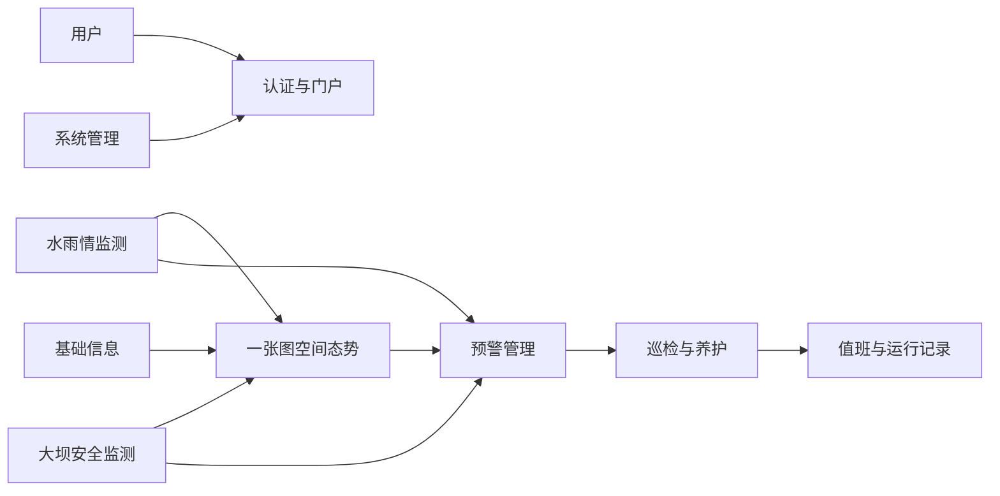
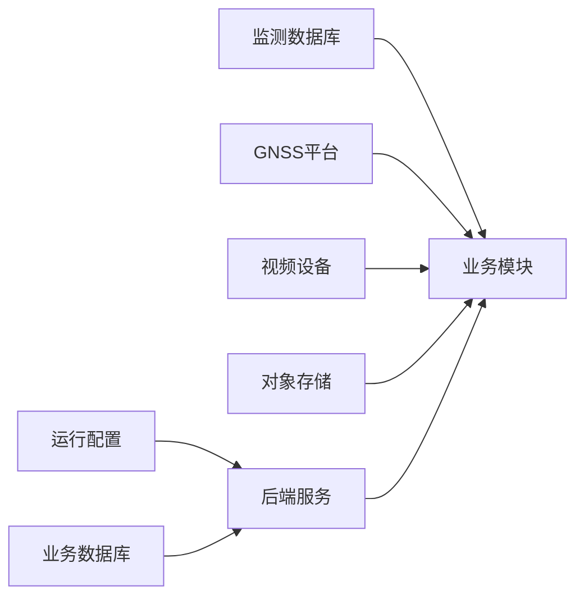
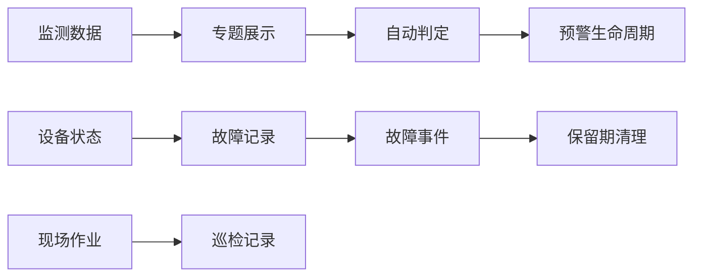

# 武穴市荆竹水库智慧水利系统 — 模块说明文档

> 本文档说明系统的业务功能定位、模块边界、端侧职责和协作关系。
> 项目结构文档负责代码文件索引，本文档负责说明业务模块如何支撑产品能力；两者不互相替代。
> 更新日期：2026-08-03
>
> **项目基础信息**

> | 类别 | 技术栈与版本 | 用途 |
> | --- | --- | --- |
> | 后端语言与运行时 | Java 8 | 后端服务开发与运行 |
> | 后端框架 | Spring Boot 2.6.2、Spring MVC | 提供 Web 服务、配置和业务承载能力 |
> | 安全认证 | Spring Security（由 Spring Boot 管理）、JJWT 0.9.1 | 无状态登录、JWT 签发与校验 |
> | 数据访问 | MyBatis Spring Boot Starter 2.2.1、Dynamic Datasource 3.2.1 | Mapper 查询和多数据源路由 |
> | 数据库 | MySQL、SQL Server、PostgreSQL；版本未固定 | 业务数据、工程监测数据和闸门/水文采集数据存储 |
> | 接口文档与运行观测 | Springdoc OpenAPI 1.6.15、Spring Boot Actuator | 接口描述和健康检查 |
> | 文件与表格处理 | 阿里云 OSS SDK 3.17.4、EasyExcel 3.1.5 | 巡检图片存储和表格处理 |
> | PC 前端框架 | Vue ^3.4.21、Vue Router ^4.3.0、Pinia ^2.1.7 | 管理端页面、路由和状态管理 |
> | PC 前端构建 | Vite ^5.1.6、Node.js >= 18.0.0 | 前端开发与构建 |
> | PC 前端样式 | Tailwind CSS ^3.4.1、Sass ^1.71.1、Less ^4.2.0 | 页面样式和预处理 |
> | PC 前端请求 | Axios ^1.6.7 | 统一请求、Token 注入和响应处理 |
> | GIS 与图表 | OpenLayers ^9.2.4、Leaflet ^1.9.4、ECharts ^5.5.0 | 地图、监测图层和趋势图展示 |
> | 视频能力 | Video.js ^8.21.0、videojs-youtube ^3.0.1、海康 WebVideoCtrl 版本未固定 | 视频预览、回放和云台控制 |
> | PC 前端辅助依赖 | FontAwesome ^6.5.1、dayjs ^1.11.10、xlsx ^0.18.5、file-saver ^2.0.5 | 图标、时间处理和表格导出 |
> | 移动端框架 | uni-app 版本未固定、Vue ^3.4.0 | Android APP 和 H5 移动端交付 |
> | 移动端状态与样式 | Pinia ^2.1.7、pinia-plugin-persistedstate ^3.2.0、Tailwind CSS ^3.4.19 | 用户状态持久化和移动端样式 |
> | 移动端构建适配 | weapp-tailwindcss ^3.4.0 | uni-app 样式适配 |
> | 外部地图服务 | 天地图、GeoServer WMS；版本未固定 | 底图、专题图层和空间展示 |
> | 外部监测与设备服务 | GNSS 监测平台、视频设备、对象存储；版本未固定 | 位移数据、视频资源和现场图片接入 |

## 1. 文档定位

本文档面向产品、业务、开发和运维人员，说明系统有哪些业务能力、各模块解决什么问题以及模块之间如何协作。项目结构文档只承担代码文件索引，本文档不替代接口契约、数据字典或具体实现说明。阅读时应先了解系统定位和端侧职责，再阅读模块边界、关系图和业务闭环。

## 2. 系统功能定位

系统面向水库运行管理场景，统一汇聚水雨情、大坝安全、闸门、视频、设备状态和预警信息，并通过 PC 管理端与移动端支撑监测研判、现场巡检、异常处置和运行留痕。

| 能力方向 | 业务目标 |
| --- | --- |
| 空间态势 | 以地图集中查看水库空间、测站、监测点和风险摘要，缩短发现问题的路径 |
| 监测研判 | 查询水位、雨量、渗压、渗流量、位移和闸门等数据，支持当前状态与历史趋势分析 |
| 风险预警 | 将监测值与指标阈值关联，形成预警等级、持续时间和解除状态 |
| 设备运维 | 识别设备到报、未到报、采集异常和恢复过程，沉淀故障历史 |
| 现场作业 | 记录巡检、异常、位置、图片和处理结果，形成现场问题闭环 |
| 运行治理 | 管理用户、角色、组织、基础资料、值班安排和值班日志，保证日常管理可追溯 |

## 3. 端侧职责划分

| 端侧或外部能力 | 职责定位 | 设计关注点 |
| --- | --- | --- |
| PC 管理端 | 面向值班、管理和运维人员，提供密集信息查询、配置和处置入口 | 筛选效率、图表分析、地图联动、批量操作和权限体验 |
| 移动端 APP | 面向现场人员，提供轻量监测查看、巡检录入和个人中心 | 单手操作、定位和拍照权限、弱网络反馈、分页加载和平台差异 |
| 后端服务 | 统一承载认证、业务规则、数据聚合、文件接入和定时检查 | 数据来源隔离、业务状态一致、统一错误处理和任务可控 |
| 本地业务数据库 | 保存用户治理、基础资料、预警、巡检、养护、值班和故障记录 | 业务对象边界、状态历史、数据权限和记录可追溯 |
| 异构监测数据库 | 提供水位、雨量、渗压、渗流量和闸门等采集数据 | 时间口径、数据新鲜度、缺测识别和查询失败降级 |
| 外部平台与设备 | 提供 GNSS 位移、视频和其他现场资源 | 外部可用性、网络边界、认证信息隔离和失败重试 |
| 对象存储 | 保存巡检现场图片等文件资源 | 文件访问安全、业务记录与文件生命周期一致 |

## 4. 功能模块总览

| 模块 | 定位 | 核心产出 | 直接依赖 |
| --- | --- | --- | --- |
| 认证与门户 | 为用户提供安全进入系统和访问业务入口 | 登录态、当前用户、门户导航、移动端入口 | 系统管理 |
| 一张图空间态势 | 以地图汇聚水库、测站、监测点和预警摘要 | 图层、点位、站点摘要、预警详情入口 | 水雨情、大坝安全、预警、基础信息、外部地图 |
| 水雨情监测 | 查询降雨和水位并支持趋势研判 | 当前值、历史列表、趋势数据 | 异构监测数据库、基础信息 |
| 大坝安全监测 | 分析渗压、渗流量和地表位移 | 测点数据、最新值、趋势和历史记录 | 异构监测数据库、GNSS 平台、基础信息 |
| 工程运行监控 | 查看闸门运行数据和现场视频 | 闸门状态、历史报表、视频预览与回放 | 闸门数据源、视频设备、基础信息 |
| 设备状态与故障 | 识别监测设备到报状态并追踪故障生命周期 | 状态总览、故障主记录、事件时间线 | 水雨情、大坝安全、外部平台、任务调度 |
| 预警管理 | 配置指标并将超限数据转为可处置预警 | 指标规则、预警记录、等级和解除信息 | 水雨情、大坝安全、基础信息、外部平台、任务调度 |
| 巡检与养护 | 管理现场检查、异常处理和维修养护记录 | 巡检记录、图片、处理状态、养护记录 | 基础信息、字典、对象存储 |
| 基础信息 | 维护监测和工程运行所需的业务主数据 | 站点、测项、预警设施、工程资料和选项 | 系统管理、业务数据库 |
| 值班与运行记录 | 管理值班计划和实际工作记录 | 值班安排、值班日志、交接依据 | 认证与门户、系统管理 |
| 系统管理 | 维护组织、人员、用户、角色、权限和字典 | 授权关系、组织资料、标准选项 | 业务数据库 |
| 移动现场作业 | 在移动端承载现场高频监测和巡检操作 | 移动监测卡片、巡检表单、位置和图片 | 认证、水雨情、大坝安全、巡检与养护、设备权限 |

## 5. 各业务模块说明

### 5.1 认证与门户

**定位**：为不同岗位提供统一身份入口、登录态维护和业务导航，保证业务操作建立在明确的用户身份之上。

**核心功能**：

- 使用账号密码登录并建立会话。
- 获取当前用户信息和角色信息。
- 在 PC 端进入业务页面前校验登录状态。
- 提供侧边栏、顶部区域、内容区域和移动端 Tab 入口。
- 支持退出登录、清理本地会话和进入巡检 APP 下载入口。

**设计边界**：

- 只负责“用户是谁、是否已登录、从哪里进入”，不负责维护用户、角色和组织资料。
- 不承载监测数据查询、预警判定或巡检业务逻辑。
- 菜单入口不等同于业务授权，业务资源仍需由服务端安全边界保护。

**依赖与协作**：

- 本模块依赖系统管理提供的用户、角色和权限基础数据。
- 所有业务模块依赖本模块提供的身份上下文。
- 移动现场作业复用同一套身份语义，但采用移动端会话和导航方式。

**开发关注点**：

- 登录态、Token 过期和退出后的清理规则必须在 PC 端与移动端保持一致。
- 新增业务入口必须同时考虑导航展示、访问控制和未登录跳转。
- 门户组件只负责布局与入口组织，不在其中堆叠业务请求。
- 当前用户密码修改和管理员重置密码应区分个人操作与系统管理操作。

### 5.2 一张图空间态势

**定位**：以空间视角汇聚水库工程、测站、监测点、图层和预警信息，帮助值班人员快速发现风险并进入专题处理。

**核心功能**：

- 展示水库区域底图并切换地图底图。
- 控制专题图层显隐并展示图例。
- 展示 GNSS、雨量、水位、渗流渗压等站点或监测点。
- 点击点位查看名称、状态和最新数据摘要。
- 展示未解除预警列表和预警详情。
- 提供工程简介或库区资料入口。

**设计边界**：

- 只负责空间汇聚、摘要展示和业务跳转，不替代监测专题的历史分析。
- 不在地图中重复维护站点、测项或预警主数据。
- 点位弹窗不承载复杂表格、配置表单和完整处置流程。

**依赖与协作**：

- 依赖水雨情、大坝安全、预警和基础信息提供摘要数据。
- 依赖天地图、GeoServer WMS 等外部地图能力。
- 可作为预警、监测和工程资料的统一入口，被 PC 门户直接使用。

**开发关注点**：

- 点位坐标、站点标识、测项名称和状态口径必须来自统一业务主数据。
- 地图首次展示、异步加载、刷新失败和无数据状态要分别处理。
- 摘要数据与专题详情必须保持同一时间和单位口径。
- 外部地图不可用时，应保证页面能明确反馈而不是阻塞其他业务入口。

### 5.3 水雨情监测

**定位**：为水库运行和值班研判提供降雨、水位等水文数据的当前查看、历史查询和趋势分析能力。

**核心功能**：

- 查询小时雨量和时间范围内的降雨记录。
- 查询水位当前值、历史记录和分页数据。
- 以折线、表格和移动端卡片呈现数据趋势。
- 支持按测站和时间范围进行筛选。
- 支持 PC 端查询结果导出。
- 为一张图、设备状态和预警检查提供水雨情摘要或数据输入。

**设计边界**：

- 负责数据查询、展示和分析，不负责超限判定和预警状态维护。
- 不负责监测站点主数据的创建、修改和删除。
- 不把设备未到报直接解释为水位或雨量业务异常。

**依赖与协作**：

- 依赖异构水文监测数据库提供原始采集数据。
- 依赖基础信息提供站点和测项的展示语义。
- 被一张图、预警管理和设备状态与故障使用。

**开发关注点**：

- 时间范围、采集时间、数据更新时间和统计周期必须明确区分。
- 图表与表格应共享查询条件和数据口径，避免同页结果不一致。
- 缺测、空值、延迟数据和查询失败必须有可识别的状态表达。
- 新增指标时应明确它属于展示分析、预警输入还是设备状态判断。

### 5.4 大坝安全监测

**定位**：围绕大坝安全相关测点，提供渗压、渗流量和地表位移数据的专题查看与变化研判。

**核心功能**：

- 按测点查看渗压相关实时值和历史数据。
- 查看水位高程、水位、水压、温度、模数等监测指标。
- 查询渗流量并以趋势和表格分析变化。
- 查询 GNSS 地表位移最新值、历史数据和统计摘要。
- 提供测点选择和最新数据汇聚能力。
- 在 PC 端和移动端提供适合各自场景的监测视图。

**设计边界**：

- 负责监测专题展示与查询，不负责阈值规则配置和预警记录生命周期。
- 不负责测点主数据维护，不把外部平台原始协议直接暴露给业务用户。
- 不负责设备到报故障记录，设备可用性由设备状态与故障模块处理。

**依赖与协作**：

- 依赖大坝监测数据库和外部 GNSS 平台。
- 依赖基础信息提供测点、测项、单位和空间信息。
- 为一张图、预警管理和设备状态与故障提供数据或摘要。

**开发关注点**：

- 每个指标必须明确单位、采集时间、展示精度和空值语义。
- 外部数据字段变化、数据延迟和数据无效不能被静默当作正常值。
- PC 端与移动端应保持测点名称、指标名称和时间口径一致。
- 趋势图、最新值和历史列表应明确各自的数据窗口，避免互相覆盖。

### 5.5 工程运行监控

**定位**：为运行人员提供闸门运行数据和现场视频的远程查看能力，支撑调度观察和现场确认。

**核心功能**：

- 查看不同闸门的实时或最近运行数据。
- 按时间范围查询闸门历史数据和报表。
- 查看视频设备实时预览和多窗口画面。
- 按时间范围进行历史录像回放。
- 通过云台控制、变焦、暂停、继续和抓图辅助现场观察。
- 在地图或工程资料入口中关联现场监控位置。

**设计边界**：

- 闸门部分负责数据查看和报表，不承担调度指令下发。
- 视频部分负责浏览器侧的视频连接与控制，不参与监测指标计算。
- 不把视频连接失败直接转换为监测预警或设备故障主记录。

**依赖与协作**：

- 闸门数据依赖异构闸门数据源，视频依赖现场视频设备和浏览器插件能力。
- 依赖基础信息提供闸门、摄像头及空间展示语义。
- 受认证、网络环境和外部设备可用性约束。

**开发关注点**：

- 视频能力必须明确内网限制、设备登录态、播放态和插件生命周期。
- 闸门编码、名称和报表口径应由统一业务资料维护。
- 预览、回放、云台控制和抓图应分别反馈成功、失败和不可用状态。
- 视频设备的控制权限应与只读查看权限分开考虑。

### 5.6 设备状态与故障

**定位**：关注 GNSS、水雨情、渗流渗压等采集设备是否按预期到报，并记录异常到恢复的完整过程。

**核心功能**：

- 按 GNSS、水雨情、渗流渗压分类查看设备状态。
- 汇总已到报、未到报和采集异常数量。
- 自动刷新状态并支持按类型和状态筛选。
- 对持续异常建立一条活跃故障主记录。
- 记录故障开始、状态变化和恢复事件时间线。
- 查询历史故障并按保留策略清理过期记录。

**设计边界**：

- 关注“数据是否按时到达”，不替代水雨情和大坝安全模块对数据内容的业务分析。
- 故障记录不等同于监测值超限产生的预警信息。
- 不修改原始采集数据，只维护设备状态和故障生命周期。

**依赖与协作**：

- 依赖水雨情、大坝安全和外部 GNSS 数据源提供最新采集状态。
- 依赖定时检查、后台重试和保留期清理能力。
- 依赖本地业务数据保存故障主记录和事件明细。

**开发关注点**：

- 必须区分正常到报、采集超时、无数据和网络访问失败。
- 同一设备同一段异常应更新活跃记录，不重复创建主记录。
- 恢复事件必须结束故障生命周期并记录持续时间。
- 新增设备类型时，应同步定义状态判定、名称、筛选和历史展示口径。

### 5.7 预警管理

**定位**：将监测数据与业务指标关联，完成预警规则配置、自动判定、信息展示和人工解除。

**核心功能**：

- 配置监测地点、监测项、上下限、等级和单位。
- 查询、创建、修改和删除预警指标。
- 按地点、类型、等级、状态和时间范围查询预警信息。
- 对水位、雨量、MCU 和 GNSS 等数据执行自动阈值检查。
- 生成一般或严重等级预警，并避免同地点同类型未解除预警重复生成。
- 解除预警并记录解除时间和持续时长。

**设计边界**：

- 预警指标是判定规则，预警信息是判定结果，二者必须分开管理。
- 不负责原始监测数据采集，不负责设备到报故障生命周期。
- 预警设施等基础资料由基础信息维护，预警模块只消费其业务语义。

**依赖与协作**：

- 依赖水雨情、大坝安全和外部 GNSS/MCU 数据。
- 依赖基础信息提供监测地点、测项、单位和坐标。
- 依赖定时任务、阈值判断和预警存储能力。
- 向一张图、值班人员和巡检处置提供风险入口。

**开发关注点**：

- 上上限、上限、下限、下下限的判断顺序和等级含义必须固定。
- 预警去重应以地点、监测类型和未解除状态为核心。
- 数据源失败、数据缺失和未超限不能混为同一种结果。
- 解除操作必须保留发生时间、解除时间、状态和持续时长。

### 5.8 巡检与养护

**定位**：记录现场检查、异常发现、图片资料、处理结果和维修养护过程，形成从现场发现到处理留痕的业务闭环。

**核心功能**：

- 新增、编辑、查看、删除和分页筛选巡检记录。
- 记录巡检站点、类型、负责人、时间、异常情况和处理状态。
- 获取现场位置并上传、预览巡检图片。
- 将异常巡检记录标记为已处理。
- 查询、新增、编辑、删除和导出维修养护记录。
- 在 PC 端和移动端复用巡检业务对象，适配不同录入方式。

**设计边界**：

- 巡检记录关注人工现场检查，设备故障关注采集可用性，预警关注监测值超限，三者不能互相替代。
- 养护记录用于维修过程留痕，不等同于巡检异常的自动处置。
- 文件存储是支撑能力，图片不单独构成业务工单。

**依赖与协作**：

- 依赖基础信息提供站点、人员和字典选项。
- 依赖对象存储完成图片保存和访问。
- 依赖认证与门户识别记录创建者和操作身份。
- 为值班和运行记录提供现场处置依据。

**开发关注点**：

- PC 表单、移动表单、详情、列表和导出必须保持字段语义一致。
- 异常情况与处理状态必须分别表达，不能只用自由文本推断状态。
- 定位、图片上传和网络失败要允许用户明确重试或补录。
- 删除、处理和图片替换等操作必须给出清晰的确认和结果反馈。

### 5.9 基础信息

**定位**：维护监测和工程运行所依赖的业务主数据，保证地图、监测、预警和巡检使用统一的站点、测项和设施语义。

**核心功能**：

- 维护监测站点编码、名称、位置和工程属性。
- 维护测项编码、名称和单位，并提供业务选项。
- 维护预警设施的名称、类型、位置、状态和责任信息。
- 展示或维护洪水防御预案等工程资料。
- 展示库区基本情况、工程概况和运行资料。
- 为地图、预警指标和巡检筛选提供稳定的选项来源。

**设计边界**：

- 只维护业务主数据和工程资料，不存储监测历史和预警结果。
- 不负责用户、角色、部门和系统字典的治理。
- 工程资料展示与动态监测数据必须保持不同的更新和责任边界。

**依赖与协作**：

- 依赖系统管理提供人员、部门和标准字典能力。
- 被一张图、监测专题、预警管理和巡检与养护共同使用。
- 依赖业务数据库保存可维护的主数据。

**开发关注点**：

- 站点编码、测项编码、单位和坐标变更必须评估对下游模块的影响。
- 选项值应稳定、可追溯，避免页面各自硬编码同一业务枚举。
- 地图点位必须校验坐标有效性和坐标口径。
- 静态工程资料与实时数据的更新时间、责任人和展示方式应明确区分。

### 5.10 值班与运行记录

**定位**：沉淀日常值班计划和实际工作过程，为交接、追溯和运行管理提供连续记录。

**核心功能**：

- 按日期范围查询值班安排。
- 创建、修改、删除和批量删除值班安排。
- 按日期范围查询值班日志。
- 创建、修改、删除和批量删除值班日志。
- 记录值班人员、时间、岗位、天气、雨量和工作内容等运行信息。

**设计边界**：

- 值班安排表达计划，值班日志表达实际发生的工作记录。
- 不直接承担监测数据统计、预警判定或巡检业务处理。
- 不把系统操作日志替代为业务值班日志，二者服务目的不同。

**依赖与协作**：

- 依赖认证与门户识别操作人员。
- 依赖系统管理提供人员、部门和角色语义。
- 消费监测、预警和巡检结果作为值班记录的业务背景，但不改变其数据归属。

**开发关注点**：

- 计划时间与实际记录时间必须明确，避免交接时产生歧义。
- 值班人员、岗位和工作内容应保留足够的追溯信息。
- 批量删除必须有明确确认和权限约束。
- 日期筛选、时区和跨日值班的口径应统一。

### 5.11 系统管理

**定位**：维护系统运行所需的组织、人员、用户、角色、权限和字典，为认证、门户和业务选项提供治理基础。

**核心功能**：

- 管理用户资料、角色分配、密码重置和个人密码修改。
- 管理角色、角色状态和菜单权限关系。
- 管理组织机构、人员和部门信息。
- 管理字典及其明细，提供扁平和树形选项。
- 为认证、门户、值班、巡检和业务筛选提供标准身份与枚举。

**设计边界**：

- 维护系统基础数据和授权关系，不处理监测业务规则和预警结果。
- 字典负责标准选项，不承担巡检、预警或监测记录的存储职责。
- 菜单展示是访问入口，不能替代服务端对业务资源的授权判断。

**依赖与协作**：

- 依赖业务数据库保存治理对象和关系。
- 为认证与门户提供用户、角色和权限依据。
- 为基础信息、巡检、值班和其他模块提供人员、部门和字典选项。

**开发关注点**：

- 新增业务页面必须同步考虑菜单入口、角色授权和服务端访问控制。
- 用户、角色、人员和部门的关联变更要考虑登录态和历史记录的可追溯性。
- 字典值变更必须评估历史数据展示和筛选条件的兼容性。
- 密码、身份证件和联系方式等敏感信息不得进入普通日志或公开错误信息。

### 5.12 移动现场作业

**定位**：面向现场人员提供高频、轻量的监测查看和巡检录入能力，减少现场操作对 PC 管理端的依赖。

**核心功能**：

- 登录、Token 持久化、当前用户查看和退出登录。
- 首页地图、水库图片和工程基础信息展示。
- 查看水位、雨量、渗压和渗流量的实时值、趋势和历史记录。
- 查看监测点并切换指标或测站。
- 查询、筛选、新增、编辑、删除和处理巡检记录。
- 获取当前位置、上传现场图片并保存巡检表单。

**设计边界**：

- 只覆盖现场高频业务，不复制 PC 端全部系统管理和复杂配置功能。
- 与 PC 端共用业务对象、状态和数据语义，不建立第二套监测或巡检规则。
- 移动端不直接替代后端认证、权限、文件和业务校验。

**依赖与协作**：

- 依赖认证与门户提供用户身份。
- 依赖水雨情、大坝安全和巡检与养护提供业务数据与操作能力。
- 依赖对象存储、定位权限、相机/相册权限和移动网络。

**开发关注点**：

- APP-PLUS 与 H5 的地图、定位、文件和权限能力必须分别验证。
- 弱网络、请求超时、重复提交和加载更多要有明确状态。
- 移动表单可简化交互，但字段含义、状态和必填规则不能与 PC 端冲突。
- 监测卡片优先展示关键指标，复杂配置和低频管理操作应留在 PC 端。

## 6. 通用支撑能力

### 6.1 认证与授权

后端统一完成身份认证、Token 校验、访问拒绝和当前用户上下文管理；前端和移动端只负责保存会话、处理登录态和呈现访问结果。

- 使用原则：所有业务资源以服务端授权为最终边界，页面入口只做体验层拦截。
- 避免：在不同端重复实现一套用户身份、角色判断或密码规则。

### 6.2 统一响应、错误和分页

系统使用统一的业务响应、异常处理和分页语义，前端请求层负责 Token 注入、未授权处理、分页字段归一和错误传递。

- 使用原则：新增业务沿用既有响应和分页口径，业务错误应能被用户理解。
- 避免：模块自行定义第二套成功码、分页字段、请求实例或静默吞掉异常。

### 6.3 多数据源与数据归属

本地业务数据、异构监测数据、外部平台数据、视频资源和对象存储分别由各自边界负责，业务模块通过统一语义消费结果。

- 使用原则：每个业务对象明确数据所有者、更新时间、失败语义和是否允许写入。
- 避免：把外部原始数据直接当成本地业务主数据，或在多个模块重复转换同一数据。

### 6.4 定时任务与异步状态

定时任务承担自动预警、设备状态检查和故障保留期清理；后台重试用于区分暂时网络故障与已确认的业务状态。

- 使用原则：任务有明确开关、时区、执行边界、失败记录和幂等策略。
- 避免：任务重复生成预警或故障记录，或把一次外部访问失败立即当成最终业务结论。

### 6.5 文件、图片与导出

对象存储承载巡检图片等文件，业务记录保存与业务对象关联的文件信息；表格导出按业务模块的数据口径生成。

- 使用原则：上传、访问、替换、删除和失败重试都要有清晰的生命周期责任。
- 避免：在业务表中保存不稳定的临时地址，或让 PC 端和移动端采用不同图片字段语义。

### 6.6 地图、图表和基础交互

地图图层、监测图表、表格、筛选、弹窗和加载状态是跨业务复用的交互支撑，应保持统一的空数据、错误、刷新和时间口径。

- 使用原则：公共组件承载稳定交互，业务模块只提供业务数据和业务动作。
- 避免：在地图弹窗中复制完整专题页面，或让不同页面各自定义相同状态的颜色和文本含义。

## 7. 模块间关键关系

### 7.1 模块依赖关系

该图表示用户先经过身份入口，业务主数据和监测专题为地图、预警及处置提供基础，最终由运行记录沉淀业务过程。

### 7.2 核心业务流向

该图表示从用户进入系统、发现监测变化、形成预警，到现场处置和记录留痕的端到端流向。

### 7.3 配置与外部依赖关系

该图表示业务模块的可用性同时受运行配置、本地业务库、监测库、GNSS 平台、视频设备和对象存储影响，外部依赖异常不应被隐藏。

### 7.4 数据与任务边界

该图表示监测展示、预警、设备故障和巡检是相互关联但独立的业务对象；任务结果按各自生命周期处理，不以一个模块的状态覆盖其他模块。

## 8. 典型业务闭环

### 8.1 监测数据到预警闭环

1. 水雨情、大坝安全或外部监测平台产生最新监测数据。
2. 对应专题模块提供当前值、历史记录和趋势展示。
3. 自动检查任务读取已配置的监测指标。
4. 系统按上下限和等级规则判断是否超限。
5. 对同地点、同类型的未解除预警执行去重，必要时生成新的预警记录。
6. 值班人员在预警列表或一张图中查看风险并执行解除操作。
7. 系统保留发生时间、解除时间、状态和持续时长，供运行追溯。

### 8.2 设备故障闭环

1. 设备状态检查分别读取 GNSS、水雨情和渗流渗压的最新到报情况。
2. 系统区分正常到报、超时未到报、无数据和网络访问异常。
3. 持续异常建立或更新对应的故障主记录。
4. 状态变化写入故障事件时间线，供前端查看过程。
5. 设备恢复到报后结束活跃故障并计算持续时间。
6. 定时清理任务按保留策略清理过期主记录和事件明细。

### 8.3 巡检处置闭环

1. 巡检人员在移动端或 PC 端选择站点、类型和负责人。
2. 录入巡检时间、位置、异常情况和现场描述。
3. 按需获取定位并上传现场图片。
4. 系统保存巡检记录和文件关联信息。
5. 管理人员查看异常记录并在处理完成后更新处理状态。
6. PC 端按条件查询或导出记录，形成管理留痕。

### 8.4 值班管理闭环

1. 管理人员建立值班安排，明确人员、岗位和时间。
2. 值班人员按计划查看水雨情、监测、预警、设备和视频信息。
3. 发现风险后通过预警、巡检或设备故障模块完成相应处置。
4. 值班人员填写实际值班日志，记录天气、雨量和工作内容。
5. 后续人员按日期查询安排与日志，支撑交接和责任追溯。

## 9. 后续开发参考原则

1. 新增功能先按用户目标和业务对象确定模块归属，再决定端侧入口和技术实现。
2. 原始监测数据、专题展示结果、预警记录、设备故障记录和巡检记录必须保持独立边界。
3. 新增监测来源必须同时明确数据所有者、采集时间、刷新周期、缺测语义和失败处理方式。
4. 站点、测项、单位、坐标和字典值属于共享主数据，修改前必须评估地图、预警、监测和巡检影响。
5. PC 端与移动端可以采用不同交互，但不能建立不同的业务字段、状态和校验口径。
6. 预警规则必须明确四级阈值、等级顺序、去重条件、解除条件和持续时间计算方式。
7. 设备状态必须区分到报正常、超时未报、无数据、网络异常和恢复，不能用一个布尔值覆盖全部含义。
8. 任何处理、解除、恢复和删除动作都必须明确操作者、时间、状态变化和数据保留责任。
9. 文件上传只在业务记录与文件资源之间建立稳定关联，不能把临时文件地址当作长期业务事实。
10. 新增页面或入口必须同时考虑身份认证、权限授权、加载/空数据/错误状态和跨端一致性。
